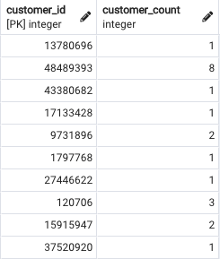
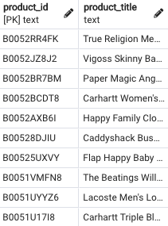
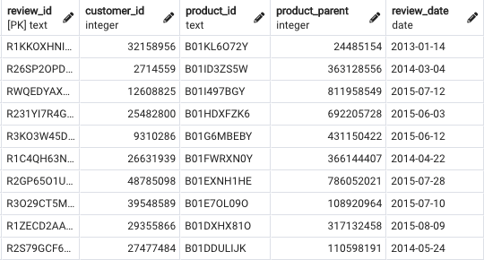
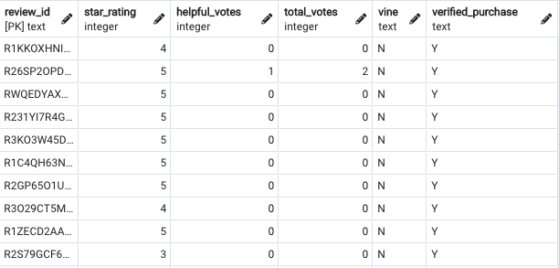
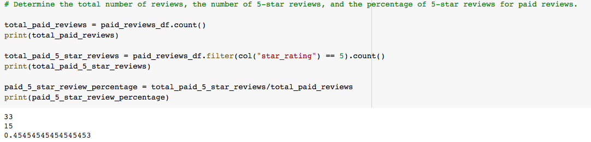
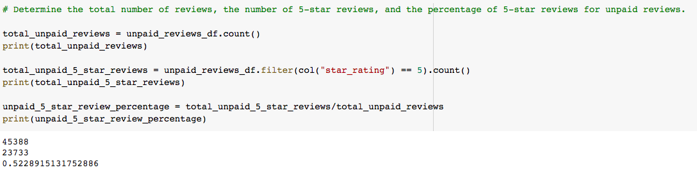

# Amazon_Vine_Analysis

## Overview 

The purpose of this analysis is to analyze Amazon reviews written by members of the paid Amazon Vine program. I have pulled the Amazon Reviews for Apparel and used PySpark to perform the ETL process to extract the dataset, transform the data, connect to an AWS RDS instance, and load the transformed the data into pgAdmin. 

## Results

The four tables were created and loaded into pgAdmin:

- Customers table

- Products table

- Review ID table

- Vine table

From the Vine table, we filtered the dataset to remove reviews that had less than 20 reviews and kept the reviews that had 50% or more helpful votes. The final result was filtered further to only show reviews with a rating of 5 and were either Vine or non-Vine reviews. 

- How many Vine reviews and non-Vine reviews were there?
There are 33 total paid reviews and 45,388 non-vine reviews. 

- How many Vine reviews were 5 stars? How many non-Vine reviews were 5 stars?
There are only 15 Vine reviews that were 5 stars and 23,733 non-Vine reviews that were 5 stars.

- What percentage of Vine reviews were 5 stars? What percentage of non-Vine reviews were 5 stars?
Vine reviews with 5 stars were 45.45% of all reviews and non-vine reviews with 5 stars were 52.23%.

## Summary
Having a paid Vine review does not make a difference in the percentage of 5 star reviews as the percentage of non-Vine reviews with 5 stars exceeded the percentage of Vine reviews with stars by 6.78%. 

An additional analysis that you can do with the dataset is to check the other star rating reviews (4 stars, 3 stars, 2 stars, and 1 star) and confirm if the above still stands true that there is no bias. 